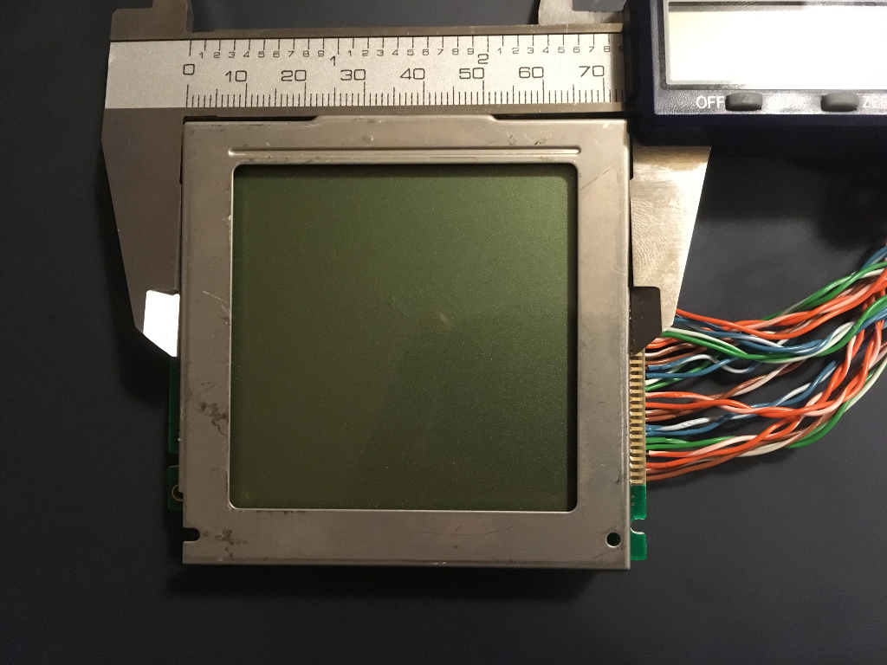
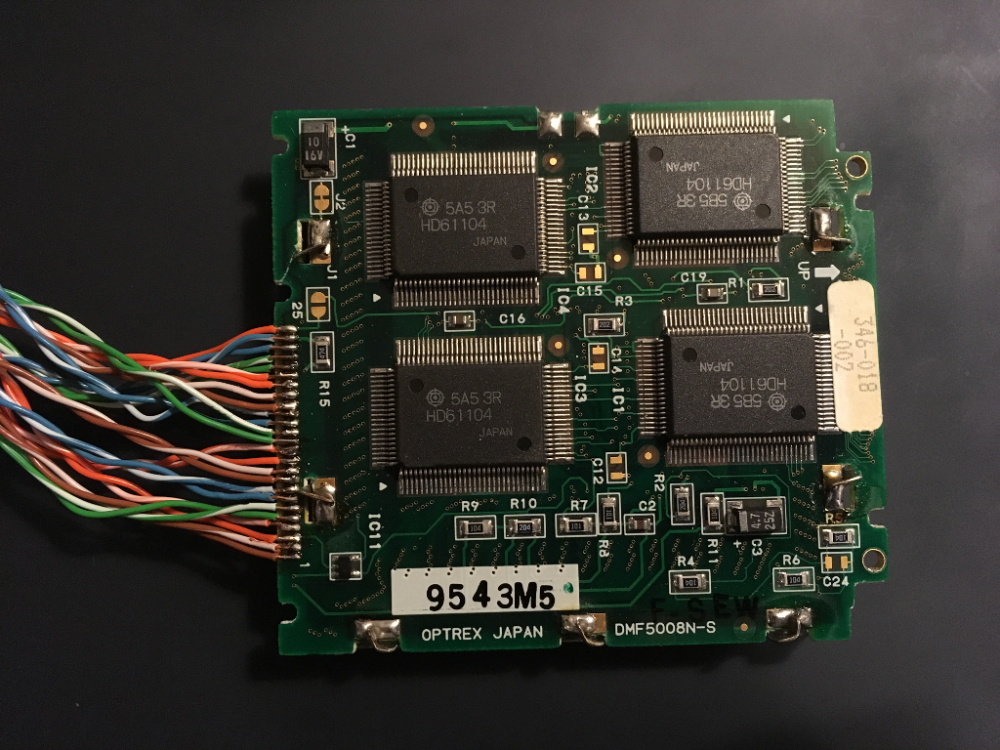

# dmf-5008-backpack
Controller backpack for Optrex DMF-5008N-S display

# Documents
 - [DMF 5000 series manual](http://www.rigelcorp.com/8051/Optrex_Dmf5000.pdf)
 - [Datasheet](http://www.pollin.de/shop/downloads/D120367D.PDF) (in German)
 - [SED1335 manual](http://www.gabotronics.com/download/datasheets/sed1335e.pdf)
 - [Example library](http://www.gabotronics.com/download/sed1335/sed1335.zip)
 - [Example schematic](http://www.rlocman.ru/i/Image/2011/07/18/Xminilab_sch.gif)
 - [Example PCB](http://www.gabotronics.com/discontinued-products/pcb-avr-xmegalab.htm)

# Interface and code
 - Accept ASCII characters and print them as normal, maybe even compatible with
   the Sparkfun LCD backpack protocol.
 - Accept some sort of control characters to do drawing primitives
 - Maybe implement some of the ASCII drawing character code-pages.
 - Do I accept USART and SPI slave the whole time? Or have a jumper?
 - Probably worth using a modified version of the gabotronics library.

# Parts
 - STM32F405RG is 48-pin LQFP, cheapest F4 with FSMC, about £6.50
 - Or I use a 48-pin F0 for £1 and bit-bang it. Sounds like the interface won't
   mine if I go too slow, and doesn't seem too complicated.
 - MIC4832 is used by example schematic for the EL step-up but that doesn't
   seem to exist anymore.
 - Gabotronics EL board uses MIC4826 or MIC4827 or MIC4832 for different
   voltages, all of which don't exist anymore.
